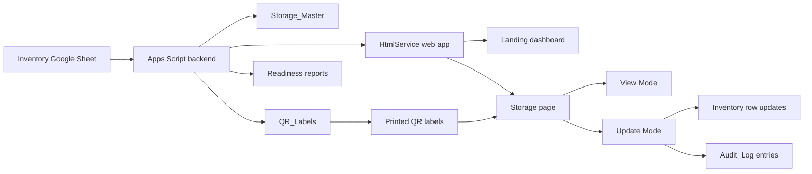

# D&T QR Inventory System

QR-based inventory management for Design & Technology workshops, built with Google Apps Script and Google Sheets.

The system gives each physical storage point a QR label. When someone scans the label, they open the live inventory page for that cupboard, tray, cabinet, trolley, rack, or room zone. Students and staff can view what should be there. Authorised technicians can update quantity and status. Admin users can generate QR links, print labels, run readiness checks, and keep a Google Sheet as the single source of truth.

## What This Project Does

- Turns a Google Sheet inventory into a mobile-friendly web app.
- Creates one live page per storage location, using QR-friendly route URLs.
- Supports read-only View Mode for students and staff.
- Supports Update Mode for authorised stock checks and technician edits.
- Writes saved changes back to the Google Sheet.
- Records quantity/status edits, added items, and removed items in `Audit_Log`.
- Generates `Storage_Master`, `QR_Labels`, and `Inventory_Readiness_Report` sheets.
- Supports chemical warning badges, safety notes, SDS links, reorder levels, suppliers, asset values, and maintenance dates when those columns exist.
- Includes print presets for Brother QL-1110 / QL-1110NWB QR labels.
- Keeps private spreadsheet IDs, deployment IDs, workbook data, and local outputs out of the public repository.

## How It Works



The app uses one Apps Script web app deployment URL. Different pages are routes on that same `/exec` URL:

```text
/exec
/exec?room=419A&loc=419A-FCU-01
/exec?room=419A&loc=419A-FCU-01&mode=tech
/exec?admin=diagnostics
/exec?admin=readiness
/exec?admin=labels
```

QR labels should normally point to View Mode. Update Mode is entered from inside the app by authorised users, or by adding `&mode=tech` to the same storage route.

## Who Uses It

| User | Main job | Typical workflow |
| --- | --- | --- |
| Students and teaching staff | Check what belongs in a storage area | Scan QR label, view items, report missing or unsafe stock |
| Technicians | Keep stock data accurate | Scan QR label, enter Update Mode, edit quantities/status, add/remove confirmed items, save |
| Admin / Head of Department | Prepare rollout and monitor readiness | Run diagnostics, build storage map, generate QR labels, review warnings, print/sample-scan labels |

## Current Rollout State

The documented production Apps Script version is `@28`.

The current implementation is focused on the Design & Technology workshop rollout, especially Room `419A`, while keeping the data model general enough for other rooms such as `V++`, material racks, electronics trays, machines, trolleys, and chemical storage.

Room `419A` uses `Location Code` as the operational QR route identity, for example:

```text
419A-FCU-01
419A-CAB-01
```

Workbook `Storage ID` values can still be preserved as metadata, but printed labels and day-to-day QR stocktake routes should use the confirmed operational location code.

## Repository Structure

| Path | Purpose |
| --- | --- |
| `code.gs` | Apps Script backend, routing, spreadsheet access, admin menu actions, imports, QR helpers, diagnostics, readiness reports, validation, and save handling |
| `index.html` | Apps Script `HtmlService` shell |
| `app_styles.html` | UI tokens and CSS for the mobile-friendly inventory interface |
| `app_script.html` | Client-side JavaScript for landing, storage pages, scanner, admin views, labels, saves, add/remove, and filters |
| `appsscript.json` | Apps Script manifest |
| `sheet_admin/InventoryAdmin.gs` | Bound Google Sheet admin-menu script for installing the same admin tools directly in the live Sheet |
| `scripts/build-preview.mjs` | Local preview builder that combines the Apps Script HTML fragments into `preview.html` |
| `ROLLOUT_CHECKLIST.md` | Operational checklist for QR rollout, printing, sample scanning, and go-live gates |
| `WORKSHOP_WORKFLOW_ROADMAP.md` | Product and workflow roadmap for scaling from QR inventory to workshop operations |
| `PRD_PROGRESS.md` | Product requirements and progress notes |

Only the Apps Script runtime files should be pushed to the Apps Script project:

```text
app_script.html
app_styles.html
appsscript.json
code.gs
index.html
```

The `.claspignore` file keeps repository-only documentation, scripts, and local files out of Apps Script pushes.

## Data Model

The live Google Sheet is the database. The app expects an inventory sheet named `Inventory` unless `INVENTORY_SHEET_NAME` is configured.

### Required Columns

The app remains compatible with the original 8-column inventory format:

| Column | Used for |
| --- | --- |
| `Item ID` | Stable item identifier |
| `Item Name` | Human-readable item name |
| `Room` | Room or area, such as `419A` or `V++` |
| `Specific Location` | Human-readable storage location |
| `Qty` | Current quantity. Non-negative decimals are allowed |
| `Category` | Item category, such as tools, electronics, materials, or chemicals |
| `Status` | `Good`, `Low Stock`, `Missing`, or `Needs Maintenance` |
| `QR Code Link (Auto-Generated)` | View-mode QR URL generated by the app |

### Recommended Columns

These columns improve QR routing, labels, and day-to-day operation:

| Column | Used for |
| --- | --- |
| `Unit` | Unit of measure, such as pcs, set, bottle, roll, kg |
| `Remarks` | Staff notes shown on item cards |
| `Location Code` | Operational QR route identity, especially for 419A |
| `Storage ID` | Workbook or legacy storage identifier |
| `Storage Label` | Friendly label printed or displayed for a storage point |
| `QR Code Image` | Optional QR image formula output |

### Operations Columns

These optional columns support safety, purchasing, asset, audit, and maintenance workflows:

```text
Storage Type
Last Updated
Updated By
Is Placeholder
Safety Note
Reorder Level
Supplier
Purchase Link
Asset Value
Maintenance Due
SDS Link
```

`Prepare App Columns` can add missing recommended and operations columns without breaking older 8-column sheets.

## Generated Sheets

| Sheet | What it contains |
| --- | --- |
| `Storage_Master` | One row per unique storage route, with view/update links, QR readiness, item counts, chemical counts, and attention counts |
| `QR_Labels` | Printable label data, view URLs, update URLs, QR formulas, hazard text, and Brother label-size guidance |
| `Inventory_Readiness_Report` | Errors and warnings before rollout, including missing routes, duplicate checks, invalid quantities, QR readiness, chemical safety notes, reorder levels, and maintenance details |
| `Audit_Log` | Append-only record of Update Mode saves, added items, and removed items |
| `Readiness_Warning_Triage` | Optional warning review board for admin decisions |
| `419A_Unmatched_Review` | Optional review sheet for unmatched legacy 419A rows |
| `PILOT_TEST_LOG` | Optional sample-scan and rollout test log |

## User Workflows

### Student / Staff View Mode

1. Scan the QR label on a storage point.
2. Confirm the room and storage identity are correct.
3. Check expected items, quantity, category, status, and remarks.
4. Watch for `Low Stock`, `Missing`, `Needs Maintenance`, and chemical warning badges.
5. Report problems to the technician or teacher.

View Mode does not show edit controls.

### Technician Update Mode

1. Open a storage QR page.
2. Use the in-app Update button, or open the same URL with `&mode=tech`.
3. Search or filter items inside that storage page.
4. Update quantity and status.
5. Add only items physically confirmed in that storage.
6. Remove items only after checking the confirmation details.
7. Save changes.
8. Confirm the saved message appears and the unsaved count clears.

Saved quantity/status changes update the `Inventory` sheet and create `Audit_Log` entries for actual changes. Add/remove actions also write audit entries.

### Admin / HoD Workflow

Use the web admin pages for quick checks:

```text
/exec?admin=diagnostics
/exec?admin=readiness
/exec?admin=labels
```

Use the Google Sheet `D&T Inventory` menu for data-changing admin actions:

1. `Config Status / Diagnostics`
2. `Prepare App Columns`
3. `Import 419A Storage Master`
4. `Import 419A App Load Ready`
5. `Build Storage Master`
6. `Create Readiness Report`
7. Fix critical errors in `Inventory_Readiness_Report`
8. `Refresh QR Links`
9. `Build QR Label Sheet`
10. Print and sample-scan QR labels

Do not print or apply physical QR labels until diagnostics and readiness checks pass.

## QR Labels And Printing

The QR Labels page can be opened with:

```text
/exec?admin=labels
/exec?admin=labels&printer=brother-ql1110
```

Supported label layouts:

| Preset | Use case |
| --- | --- |
| `A4 labels` | Office/PDF preview and sheet printing |
| `Brother 90x29` | Slim short labels for simple non-chemical storage |
| `Brother 102x50` | Compact Brother continuous-roll storage labels |
| `Brother 102x70 safety` | Larger labels with room for hazard wording, recommended for chemical or mixed batches |

Recommended Brother QL-1110 / QL-1110NWB driver settings:

- Choose the matching continuous roll size.
- Set scale to `100%` or actual size.
- Set margins to `None`.
- Disable browser headers and footers.
- Print a small sample before a batch.
- Scan at least one 419A label and one non-419A label on a phone before rollout.

Browser printing is intentional. Apps Script `HtmlService` cannot silently print to USB, Bluetooth, Ethernet, Wi-Fi, Brother driver, or AirPrint devices.

## In-App QR Scanner

The mobile app includes a `Scan QR` action. It uses the browser camera over HTTPS.

The scanner tries:

1. Native `BarcodeDetector` QR detection where the browser supports it.
2. `jsQR` from jsDelivr as a fallback.
3. Manual entry of a `Location Code` or pasted `/exec?room=...&loc=...` URL if camera access is blocked or unsupported.

Scans and pasted QR URLs open View Mode by default.

## Configuration

Set configuration in Apps Script `Script Properties`, or through the spreadsheet menu.

### Required

```text
SPREADSHEET_ID
```

### Recommended

```text
WEB_APP_BASE_URL
```

Use the deployed `/exec` URL, for example:

```text
https://script.google.com/macros/s/<YOUR_DEPLOYMENT_ID>/exec
```

`WEB_APP_BASE_URL` is required for QR link generation and external absolute links. In-app browsing can still work without it.

### Optional

```text
INVENTORY_SHEET_NAME
```

Use this only if the inventory tab is not named `Inventory`.

## Local Development

Requirements:

- Node.js for syntax checks and local preview generation.
- `clasp`, either installed globally or run through `npx`.
- A Google account authorised to access the Apps Script project and target spreadsheet.

Log in to clasp:

```sh
npx --yes @google/clasp login
```

Check Apps Script syntax:

```sh
node --check --input-type=commonjs < code.gs
```

Build a local browser preview:

```sh
node scripts/build-preview.mjs
```

Then open `preview.html` in a browser.

Do not open `app_script.html` directly. It is an Apps Script include fragment and needs `index.html` plus bootstrap data.

Confirm only intended runtime files are tracked for Apps Script push:

```sh
npx --yes @google/clasp status
```

Expected tracked files:

```text
app_script.html
app_styles.html
appsscript.json
code.gs
index.html
```

## Push And Deploy

This repository does not include `.clasp.json` because that file contains the private Apps Script project ID.

After configuring clasp locally, push runtime files to Apps Script:

```sh
npx --yes @google/clasp push --force
```

Create or update a deployment only after testing the pushed code:

```sh
npx --yes @google/clasp deploy \
  --deploymentId <YOUR_DEPLOYMENT_ID> \
  --description "D&T QR Inventory release"
```

## Installing The Bound Sheet Admin Menu

The standalone Apps Script project is the authoritative web app runtime. The live dashboard spreadsheet can also have a small bound Apps Script project so the Sheet itself shows the `D&T Inventory` menu.

Bound script source:

```text
sheet_admin/InventoryAdmin.gs
```

Install or refresh it:

1. Open the live dashboard Google Sheet.
2. Go to `Extensions` -> `Apps Script`.
3. Replace any obsolete menu code with `sheet_admin/InventoryAdmin.gs`.
4. Save and reload the Sheet.
5. Confirm the `D&T Inventory` menu appears.
6. Run non-destructive checks first: `Config Status / Diagnostics` and `419A Readiness Summary`.

Do not run import actions until the source workbooks have been converted to Google Sheets and the source tabs are confirmed.

## Privacy And Public Repository Notes

This repository is designed to be public source code and documentation.

It intentionally does not include:

- the live Google Sheet;
- private student, staff, item, purchasing, or school records;
- downloaded Excel workbooks;
- generated database-match outputs;
- `.clasp.json`;
- Apps Script project IDs;
- live deployment IDs;
- Google Workspace account details;
- local screenshots or prototype export artifacts.

The source code leaves `DEFAULT_SPREADSHEET_ID` and `DEFAULT_WEB_APP_BASE_URL` blank. Configure those values through Script Properties instead of committing live IDs.

## Troubleshooting

| Problem | What to check |
| --- | --- |
| App says `SPREADSHEET_ID is not set` | Set `SPREADSHEET_ID` in Apps Script Script Properties or through `D&T Inventory` -> `Set App Config` |
| App cannot find the inventory sheet | Rename the tab to `Inventory` or set `INVENTORY_SHEET_NAME` |
| QR links are blank or old | Set `WEB_APP_BASE_URL`, then run `Refresh QR Links` and `Build QR Label Sheet` |
| A storage page opens the wrong location | Check `Room`, `Specific Location`, `Storage ID`, `Storage Label`, and `Location Code`; then rebuild `Storage_Master` |
| Update Mode does not save | Open the deployed `/exec` URL, not the local preview; check quantity validation and Apps Script permissions |
| Scanner cannot open the camera | Use HTTPS, start camera from a user tap, allow browser permission, or enter the Location Code manually |
| Brother labels crop the QR code | Use the matching roll size, scale 100%, margins None, headers/footers off, and print a single sample first |

## Rollout Gate

Before physical QR labels are printed and applied:

- diagnostics must have no critical configuration error;
- readiness report must have no critical errors;
- storage pages must load from direct QR-style URLs;
- QR links and QR images must be generated;
- sample printed labels must scan correctly on a phone;
- Update Mode save must work on a safe test row;
- chemical storage must show hazard styling and safety notes where applicable;
- View Mode must be understandable to students and teaching staff;
- technicians must understand save validation and failed-save recovery.

If a critical item fails, pause rollout and fix it before applying labels.

## Related Documents

- [Rollout checklist](ROLLOUT_CHECKLIST.md)
- [Workshop workflow roadmap](WORKSHOP_WORKFLOW_ROADMAP.md)
- [PRD and progress notes](PRD_PROGRESS.md)

## License

This project is released under the [MIT License](LICENSE).
